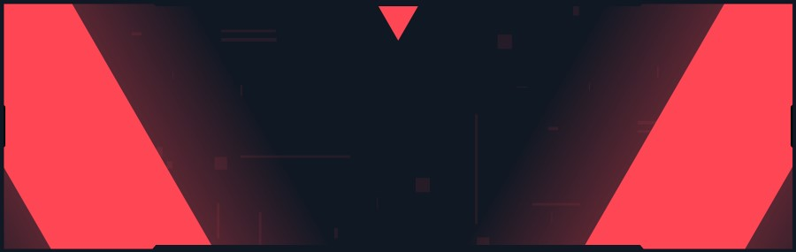

<h1 align="center">
    Hi, I'm
    
    Mohammed Qasim Khan
     
</h1>
    

<h3 >MY SKILLS</h3>

     
 
 

   

 

  

 

  

 

 

 

<h3>WHAT I'M UP TO</h3>
<blockquote><b>⑆</b> Currently I'm learning about Human-Computer Interaction principles and brainstorming an eye-tracking application to be used to control a mouse for the use case that a disabled person might be using it. I'm using <a href=https://www.youtube.com/watch?v=ZpKsKwiroGs>this video</a> as inspiration  
 
<b>⑆</b> I'm also trying to write a "stats-predictor" for basketball in JS to predict a season for a player (a la Basketball Reference's season-asjusted predictions, but with different stats as inputs and a different fit equation)  </blockquote>

<h3 >MY GOALS</h3>
<blockquote>✪ Become a Dev-Ops Engineer  
✪ Get a Masters in Data Science & Machine Learning  
✪ Develop an application/software to assist movement-impaired (hands or paralysis) people in using computers </blockquote>

<h3>MY PROJECTS</h3>

